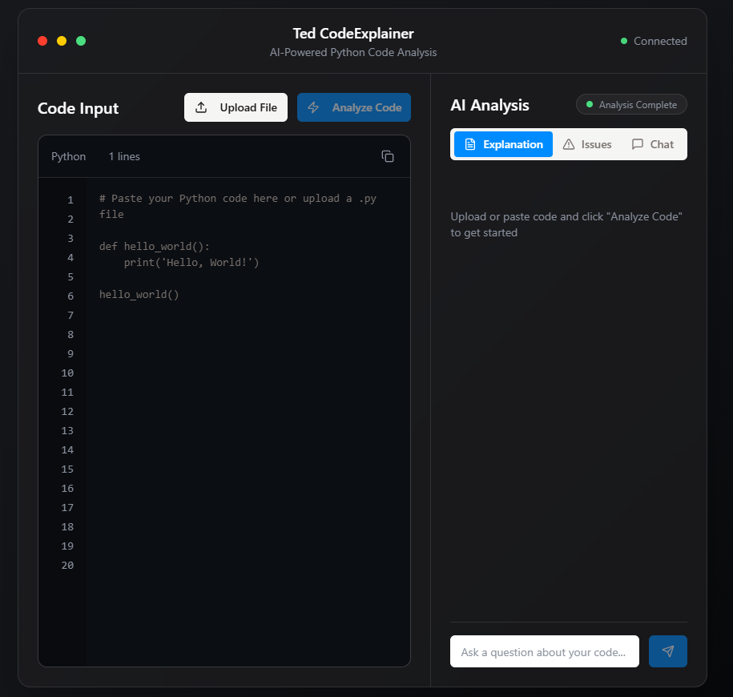
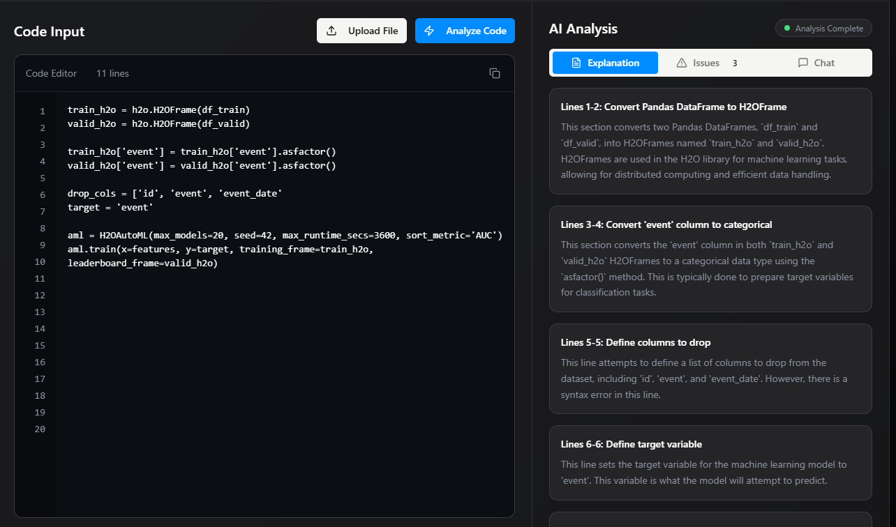
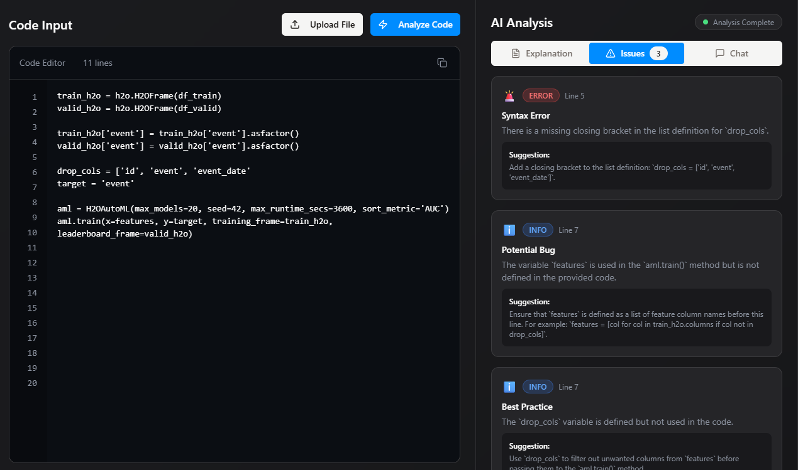

# Ted Code Explainer

A web app for code analysis and editing, built with React and TypeScript. Uses OpenAI for code suggestions and is ready to run on Replit.

---

## Table of Contents

- [Ted Code Explainer](#ted-code-explainer)
  - [Table of Contents](#table-of-contents)
  - [Features](#features)
  - [Getting Started](#getting-started)
    - [Prerequisites](#prerequisites)
    - [Installation](#installation)
    - [Environment Variables](#environment-variables)
  - [Development](#development)
    - [Running the Client](#running-the-client)
    - [Running the Server](#running-the-server)
  - [Project Structure](#project-structure)
  - [Scripts](#scripts)
  - [Deployment](#deployment)
  - [Running on Replit](#running-on-replit)
  - [.gitignore](#gitignore)
  - [License](#license)

---

## Features

- Code analysis and editing in the browser  
  Experience a clean and intuitive interface for code analysis and editing.  
  

- OpenAI integration for smart code suggestions  
  Get clear explanations for your code using OpenAI integration.  
  


- Bug detection and feedback  
  Easily spot and understand bugs in your code with visual feedback.  
  

- Ready for online development with Replit

---

## Getting Started

### Prerequisites

- [Node.js](https://nodejs.org/) (v18+ recommended)
- [npm](https://www.npmjs.com/) or [yarn](https://yarnpkg.com/)
- (Optional) [Replit](https://replit.com/) account for online development

### Installation

1. **Clone the repository:**
   ```powershell
   git clone <repo-url>
   cd code-assistant
   ```

2. **Install dependencies:**
   ```powershell
   npm install
   ```

### Environment Variables

Create a `.env` file in the root and add your OpenAI API key and any other required variables:

```env
OPENAI_API_KEY=your_openai_api_key
# Add other variables as needed
```

---

## Development

### Running the Client

```powershell
cd client
npm run dev
```
- The client will be available at `http://localhost:5173` (default Vite port).

### Running the Server

```powershell
cd server
npm run dev
```
- The server will run on the port specified in your config (commonly `3000` or `5000`).

---

## Project Structure

```
components.json
drizzle.config.ts
package.json
postcss.config.js
tailwind.config.ts
tsconfig.json
vite.config.ts
client/
  src/
    components/      # UI components
    hooks/           # Custom React hooks
    lib/             # Utilities and API logic
    pages/           # Page components
server/
  services/          # External API integrations (e.g., OpenAI)
  routes.ts          # API routes
  storage.ts         # Storage logic
shared/
  schema.ts          # Shared types/schemas
```

---

## Scripts

- `npm run dev` — Start development server (client or server)
- `npm run build` — Build for production
- `npm run start` — Start production server
- `npm run lint` — Lint codebase

---

## Deployment

1. **Build the client:**
   ```powershell
   cd client
   npm run build
   ```

2. **Build the server:**
   ```powershell
   cd server
   npm run build
   ```

3. **Start the server:**
   ```powershell
   npm run start
   ```

4. **Configure environment variables on your production server.**

---

## Running on Replit

- Import this repo into Replit or create a new Replit and clone it.
- Make sure to add your `.env` variables in the Replit Secrets tab.
- Use the Replit shell to run the client and server as described above.
- Replit will handle the online development environment for you.

---

## .gitignore

Make sure your `.gitignore` includes:

```
node_modules/
.env
dist/
build/
.DS_Store
*.log
.vscode/
*.local
coverage/
```

---

## License

Distributed under the MIT License. See `LICENSE` for more information.